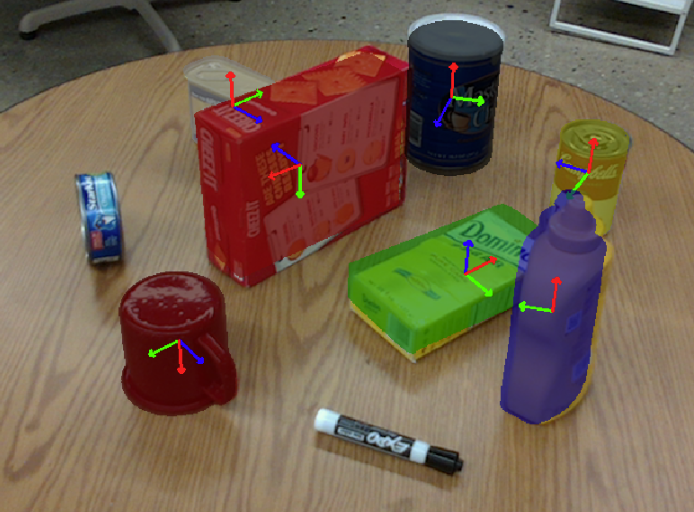
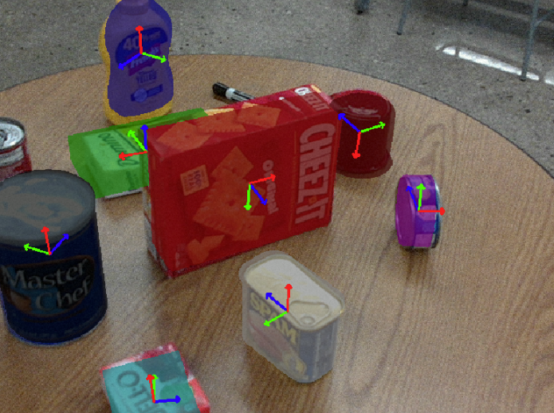
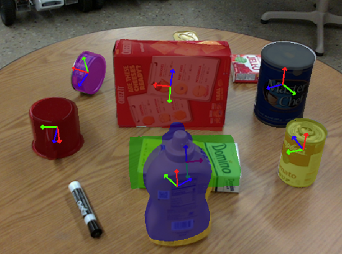
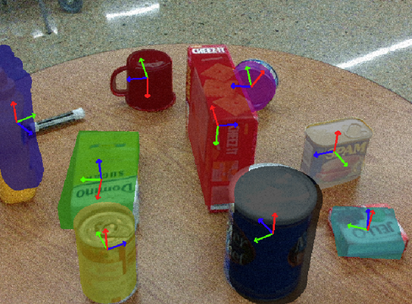
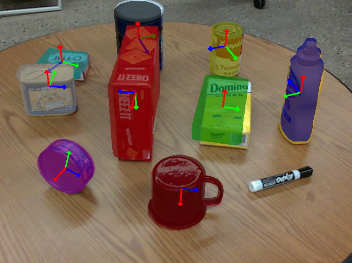
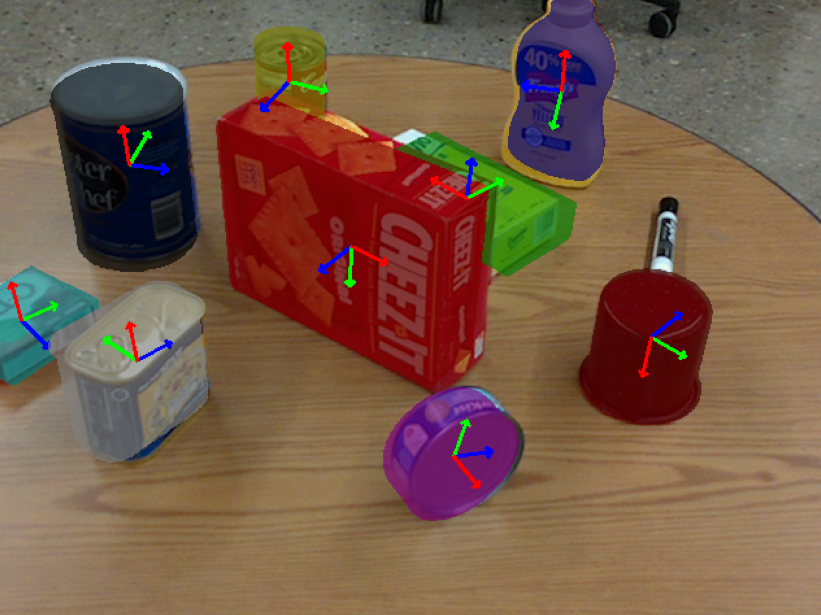

# PoseCNN_pytorch
This is an implementation of PoseCNN for 6D pose estimation on PROPSP dataset
<div align="center">
    
    
    
    
    
    
</div>

# System Requirements
We tested the codes on 
```bash
PyTorch version: 2.3.1
CUDA version: 12.1
Ubuntu 22.04
GeForce RTX 4070 and 4090

```

# Dependencies

The project requires the following Python libraries and versions:

| Package       | Version    | Description                                         |
|---------------|------------|-----------------------------------------------------|
| `matplotlib`  | `3.7.2`    | For plotting and visualization.                     |
| `numpy`       | `1.24.3`   | Fundamental package for numerical computations.     |
| `Pillow`      | `11.0.0`   | Library for working with image processing tasks.    |
| `pyrender`    | `0.1.45`   | Rendering 3D scenes for visualization.              |
| `torch`       | `2.3.1`    | PyTorch library for deep learning.                  |
| `torchvision` | `0.18.1`   | PyTorch's library for vision-related tasks.         |
| `tqdm`        | `4.66.4`   | For creating progress bars in scripts.              |
| `trimesh`     | `4.4.3`    | For loading and working with 3D triangular meshes.  |

### Installing Dependencies

You can install the required dependencies using the `requirements.txt` file:

```bash
pip install -r requirements.txt

```
## Dataset Preparation

To use this project, you need to download the required dataset and extract it to the root path of the project.

### Steps to Prepare the Dataset

1. **Download the Dataset:**
   - Download the dataset from the following link:  
     [PROPS-Pose-Dataset](https://drive.google.com/file/d/15rhwXhzHGKtBcxJAYMWJG7gN7BLLhyAq/view)

2. **Place the Dataset:**
   - Move the downloaded file `PROPS-Pose-Dataset.tar.gz` to the root directory of the project.

3. **Extract the Dataset:**
   - Use the following command to extract the dataset:
     ```bash
     tar -xvzf PROPS-Pose-Dataset.tar.gz
     ```
   - This will create a folder named `PROPS-Pose-Dataset` in the root directory.

4. **Verify the Dataset Structure:**
   - Ensure the folder structure matches the following:
     ```
     PROPS-Pose-Dataset/
         ├── train/
         │   ├── rgb/
         │   ├── depth/
         │   ├── mask_visib/
         │   ├── train_gt.json
         │   ├── train_gt_info.json
         ├── val/
         │   ├── rgb/
         │   ├── depth/
         │   ├── mask_visib/
         │   ├── val_gt.json
         │   ├── val_gt_info.json
         ├── model/
             ├── 1_master_chef_can/
             ├── ...
     ```

5. **Set Dataset Path in Code:**
   - The project will automatically locate the dataset in `PROPS-Pose-Dataset` under the root path during execution. Ensure this directory exists before running the code.

---

## Training

### Training
To train the model, run the `train.py` script:

```bash
python train.py
```

## Inference

To visualize the results, follow these steps to set up and run the `inference.py` script:

### Steps for Inference

1. **Download Pretrained Weights:**
   - Download the pretrained model weights from the following link:  
     [PoseCNN Pretrained Weights](https://drive.google.com/file/d/1-9iheQf-TL5MjHTYZITulqbdFn5UK1Sd/view?usp=sharing)

2. **Place the Weights:**
   - Save the downloaded weights file (e.g., `posecnn_weights.pth`) to your desired directory.

3. **Set the Weights Path in Code:**
   - Open the `inference.py` script and locate the following line:
     ```python
     posecnn_model.load_state_dict(torch.load(os.path.join("your weight here")))
     ```
   - Replace `"your weight here"` with the path to your weights file. For example:
     ```python
     posecnn_model.load_state_dict(torch.load(os.path.join("models/posecnn_weights.pth")))
     ```

4. **Run the Inference Script:**
   - Execute the script to visualize predictions:
     ```bash
     python inference.py
     ```


